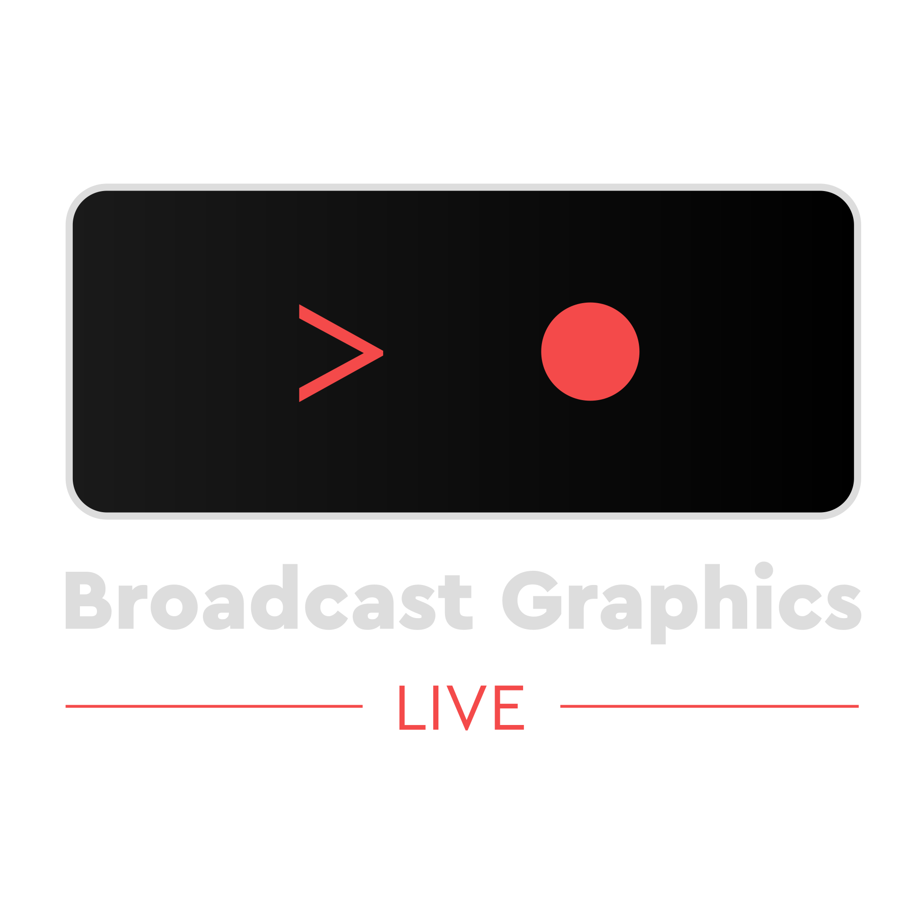

# Broadcast Graphics Live

<p align="center">
  
</p>

**Broadcast Graphics Live** is a native C++/Qt graphics plugin for OBS Studio. It combines a dockable title manager, a layered motion-graphics editor, timeline animation, live text and image cueing, template workflows, and native OBS source playback—without relying on browser sources or separate titling software.

**Current development version: `v0.8.5-alpha` · `Development Version 045`**

### Development Version 045 — Adaptive timeline ruler scaling

Reworks the timeline ruler around zoom-aware, frame-aligned major and minor intervals so tick marks remain visually separated at every zoom level. Label spacing is derived from the active font metrics and visible duration, overlapping labels are suppressed defensively, and low zoom levels no longer attempt to draw every frame. The ruler now scales from precise frame detail to clean multi-second intervals without producing stacked numbers or dense vertical-line bands.

### Development Version 044 — Reliable editor keyboard routing

Restores dependable **Space to Play/Pause** behavior across the editor, including when the GPU/QWindow-backed canvas or timeline owns focus. The editor now claims transport, tool, history, clipboard, delete, duplicate, grouping, ruler, guide, and snapping commands during Qt's `ShortcutOverride` phase without executing them prematurely, then dispatches each command exactly once on the real key press. The shortcut audit also adds consistent direct routing for Group/Ungroup, preserves native typing and local undo/redo inside text-entry controls, recognizes plain-text editors correctly, and prevents modified Space combinations from toggling playback accidentally.

### Development Version 043 — Free Transform, deterministic tickers, and a rebuilt Template Library

Development Versions 026–043 expand the editor with animatable projective Free Transform controls, higher-quality adaptive texture warping, deterministic ticker playback through a keyframeable **Completion** property, and a shared paragraph-layout pipeline for Vertical Smooth tickers. The Template Library now includes two metadata-driven collections with twelve ready-to-use broadcast and podcast graphics, generated previews, dynamic Category/Subcategory/Collection views, and the same list/icon presentation used by the main Dock. This delivery also restores editor shortcuts over the GPU canvas, optimizes transformed ticker rendering, unifies automatic and manual cue completion with **When cue ends**, improves Dock thumbnail sizing and selection cursors, and restores immediate layer-ordered hover feedback on the canvas.


## What is new in `v0.8.5-alpha`

This release consolidates the Development Version 003–025 work on top of the updated `v0.8.4-alpha` documentation baseline. The main additions are:

- **Extensible effects architecture:** introduces the Broadcast Graphics Live extension API/SDK, extension package discovery, stable effect identities, ABI migration and validation, native-library lifecycle cleanup, and a canonical catalog shared by built-in and external effects.
- **Adjustment and Color Solid layers:** adds dedicated compositing layers with normal transforms, parenting, masks, track mattes, opacity, full effect stacks, bounded adjustment coverage, and destination-aware rendering.
- **Unified editor/source compositing:** the editor and OBS source now share destination selection and backdrop-capture logic, including affect-behind effects, adjustment processing, masks, and scene-mask ordering.
- **Group containers and nested hierarchy:** groups are persistent non-rendering containers with dynamic descendant bounds, nested-group support, hierarchy-safe copy/paste/duplicate/delete, collapse/expand behavior, and group-aware layer ordering.
- **Group effects and backdrop processing:** effects applied to groups operate on the composited child result; affect-behind effects request the correct source backdrop, while shadow/glow clipping uses the untouched pre-effect silhouette.
- **Improved group editing:** grouped children resize correctly through scaled or rotated parent transforms, remain independently editable, avoid snapping to their own parent, and expose group bounds without child-edit handles.
- **Layer and timeline hierarchy UI:** group children are indented and hidden when collapsed, group strips use their own visual identity and child counts, and timeline/layer-list ordering follows the hierarchy.
- **Layer colors:** layer-assigned colors now drive layer rows, timeline strips, bounding boxes, handles, and related editor chrome for faster visual identification.
- **Unified canvas layer menu:** adds show/hide, lock, duplicate, clipboard actions, grouping, add/remove from group, flips, 90-degree rotation, and complete front/back ordering controls directly on the canvas.
- **Scene-mask and adjustment fixes:** scene masks follow balanced OBS active/showing lifecycle rules, render in true layer order, and apply effects after the scene has been clipped by its matte.
- **Expanded-effect bounds:** blur, outline, shadows, glow, glare and similar effects retain pixels outside original layer or group bounds instead of being cropped.
- **Cue-first-row source option:** an OBS source can automatically cue and play the first live-text row when activated, while remaining compatible with cache readiness and playlists.
- **Runtime and shutdown hardening:** improves cache identity, resource eviction, extension cleanup, scene-mask teardown, and protection against shutdown crashes or stale retained resources.
- **New structural contract tests:** adds automated coverage for extension auditing, GPU masks, group containers, nested hierarchy/timeline behavior, grouped-child resizing, canvas actions, and layer-color visuals.

### Development Version 016 — Grouped child resize and canvas layer menu

Fixes runaway resizing for layers nested inside scaled or rotated groups by evaluating resize handles in the complete parent/world transform and converting canvas-space compensation back to parent-local coordinates. The canvas now exposes a unified layer context menu with show/hide, lock/unlock, duplicate, cut, copy, paste, delete, Group, Ungroup, Add to Group, Remove from Group, Flip Horizontal/Vertical, Rotate Left/Right 90°, Bring to Front, Bring Forward, Send Backward and Send to Back. Group descendants move together during layer-order operations while preserving their internal order.

### Development Version 015 — Group containers ported to the Version 014 codebase

Ports the complete grouping repair originally developed against Development Version 004 onto the newer Version 014 project without replacing its later changes. Groups are persisted non-rendering container layers, selecting Group creates and selects the container itself, bounds update dynamically from descendants, nested groups remain intact, and the Layers context menu provides Group, Ungroup, Add to Group and Remove from Group. Group rows support indentation and collapse/expand carets, while copy, duplicate, paste and delete preserve the complete hierarchy. Text, image and vector children remain independent renderable layers, preventing grouped text from disappearing.

### Development Version 014 — Cue first row on source activation

- Adds a per-source **Cue first row when active** option to the OBS source properties.
- When enabled, source activation applies live-text row 1 immediately and starts the normal cue playback state machine, including cache readiness gating.
- Reactivation restarts the first cue cleanly, clears stale uncue/persistence state, and keeps scene-mask activation synchronized with the newly cued row.
- Playlist restart behavior remains compatible: an enabled forward playlist continues from the second row after the automatic first-row cue.

### Development Version 013 — Full-composite adjustment blur and shutdown hardening

- Adjustment blur now samples the complete lower-layer composite and preserves the effected alpha inside the adjustment coverage, so text and shapes crossing the adjustment boundary blur continuously without processing the editor checkerboard.
- Color-only adjustment effects retain their normal alpha behavior, while blur/glow/shadow extents remain visible outside source geometry.
- Frontend shutdown now marks title sources as tearing down before OBS destroys nested scene graphs. Scene-mask references avoid synchronous active/showing callbacks during final teardown, preventing the shutdown crash introduced by the ordered scene-mask compositor.

### Development Version 012 — Transparent-artwork adjustment blur

- The editor GPU preview now renders title artwork and adjustment effects against transparency, never against the transparency checkerboard.
- Blur, distortion and color-processing effects sample the complete accumulated title composite below the Adjustment Layer.
- The checkerboard is composited only after GPU readback, so it remains sharp while text, shapes, color layers and other artwork are blurred correctly.
- Effect-generated alpha outside layer bounds, including blur tails, shadows and glows, remains visible over the checkerboard instead of being clipped.


### Development Version 011 — AE-style adjustment preview and ordered scene-mask stack

- Adjustment effects process only title artwork, never the editor checkerboard.
- Effect-generated pixels such as shadows, glows, bloom and blur tails remain visible outside layer bounds.
- Scene-mask layers retain their hatched editor control fill and show the configured OBS scene through the matte.
- Multiple scene masks and ordinary title layers are composited once, in true layer order.


### Development Version 011 — AE-style adjustment masks and ordered scene-mask compositing

- Adjustment layers continue to process only the accumulated artwork below them, with their transformed bounds, opacity and track matte defining the influence region; the editor checkerboard remains outside the effect graph.
- Scene-mask layers now remain visible as ordinary artwork in the editor, preserving their fill and effect stack instead of being replaced by a hatch preview.
- OBS scenes assigned to scene masks are inserted at the scene-mask layer position. Layers above each scene mask are recomposited afterward, preserving timeline order for normal artwork, adjustments and multiple scene masks.
- Scene-mask editor overlays are outline-only so they do not hide the rendered fill or effects.


- Added the required forward declaration for `apply_gpu_mask()` before the adjustment coverage renderer uses it.
- Fixes MSVC error C3861 in `title-source.cpp` without changing the adjustment coverage or masking behavior introduced in Development Version 008.

> [!WARNING]
> `v0.8.5-alpha` is an advanced development build, not a production-stable release. The main authoring, serialization, playback, live-cue, caching, vector-editing, and template workflows are implemented, but several planned features, UI refinement, compatibility testing, and systematic bug hunting remain before beta. File formats, UI behavior, and internal APIs may still change. Keep backups of important title libraries and templates.

Broadcast Graphics Live is an independent third-party project and is not affiliated with or endorsed by the OBS Project.

## Development approach

This project is the result of **vibe coding**. **Antonios Dimopoulos** defines the product vision, broadcast workflows, desired behavior, interface decisions, architecture goals, and acceptance criteria, while AI-assisted development tools help translate those requirements into C++/Qt implementation. He knows considerably more about what he wants to build than he does about C++.

That development model makes validation especially important. This alpha should be treated as experimental: code changes need diff review, structural and build checks, focused automated tests, and real OBS runtime testing before they can be considered reliable for production use.

## What changed in `v0.8.5-alpha`

Compared with the current GitHub `main` snapshot, this development archive advances the unified GPU pipeline through the Phase 12D–15 work:

- The project is fully renamed to **Broadcast Graphics Live**, including application branding, plugin/package identifiers, settings scopes, source IDs, namespaces, build variables, documentation, and the `.obgt` title-template extension.
- Broadcast Graphics title templates use `.obgt`; effect presets use `.obgeffect`; text transitions use `.obgtranst`; and general transitions use `.obgtransg`.
- The first-launch editor workspace now matches the broadcast layout reference: compact tools on the far left, title properties/color libraries/effects on the left, layer properties on the right, and a full-width bottom timeline.
- Cache, diagnostic file logging, and editor Adaptive Resolution are disabled by default; each remains available as an explicit user option.
- The About dialog now displays the supplied Broadcast Graphics Live logo. Its `#dddddd` artwork color is resolved at paint time from the active OBS theme icon color, while the SVG asset itself remains unchanged on disk.
- The editor text canvas uses the same immutable layout and GPU SDF text artwork path as the OBS source, including GPU-derived caret/selection geometry and corrected outer/mid/inner text strokes with independent Behind/Front ordering.
- Alpha, inverted-alpha, luma, and inverted-luma track mattes moved into the shared GPU graph, including nested matte dependencies, scene masks, effects-before/after-mask ordering, and bounded retained matte textures.
- Prerendered RAM frames are reconstructed directly from shared, content-addressed 128×128 GPU tile textures. SSD output uses final-frame-only triple-buffered staging, a separate writer queue, and content-addressed LZ4-compressed 256×256 tiles shared between frames.
- RAM allocation is dynamically clamped from 16 MB up to 50% of installed physical memory, according to the user preference.
- Phase 15 runtime visibility recovery restored the last known working Phase 14 artwork path after premature legacy removal caused text, vectors, masks, and effects to disappear. Cache ABI v24 invalidates blank frames from that failed renderer generation.
- The standalone Line primitive was removed from the shape-tool list; line artwork remains available through open Pen paths.
- Added dedicated **Adjustment Layer** and **Color Solid** layer types for non-destructive full-frame compositing and reusable procedural backgrounds.
- Added GPU effects for **Lens Flare**, **Vignette**, **Noise**, and **Roughen Edges**. Lens Flare includes five selectable flare profiles, aspect-correct placement, and premultiplied-alpha compositing.
- Added general transitions for **Blocks**, **Image Wipe**, **Clock**, **Iris**, and **Gradient Wipe**, with editable transition-specific parameters and serialization.
- Updated the A → B transition preview so the new transition families are represented by their real animation logic instead of a generic fallback.
- Effects, transitions, and animation browsers now flatten single-item categories and omit empty category branches for a cleaner preset hierarchy.
- Restored editor keyboard actions for Undo, Redo, Cut, Copy, Paste, Delete, New, and Save across native and embedded editor-window contexts.
- Expanded cache and prerender hashing/invalidation for procedural effects, adjustment layers, temporal Noise state, and Image Wipe asset changes, preventing stale cached output.
- Fixed OBS shader-loading and runtime failures affecting the new procedural effects, including the Lens Flare DX11 compile failure caused by reserved HLSL identifiers.
- Added stronger diagnostics and crash-safety around effect creation, shader compilation, malformed preset data, and renderer fallback paths.

---

## Highlights

### Native OBS integration

- Native OBS input source: **Broadcast Graphics Live Title**.
- Dockable title and template manager inside OBS Studio.
- Add the selected title directly to the active scene.
- Scene-collection-specific title libraries.
- Native rendering and playback through `libobs`.
- Scene-mask support for using OBS scenes as animated mask inputs.
- Persistent plugin preferences and title metadata.

### Layered editor and canvas

- Non-modal Qt editor with canvas, tools, layers, properties, effects, styles, and timeline panels.
- Layer types:
  - Text
  - Clock
  - Ticker
  - Image
  - Solid rectangle
  - Vector shape
  - Color Solid
  - Adjustment Layer
- Shape primitives:
  - Rectangle
  - Rounded rectangle
  - Ellipse
  - Triangle
  - Star
  - Polygon
  - Diamond
- Direct canvas selection, movement, resizing, rotation, anchor/origin editing, and multi-selection.
- Pen Tool for open and closed straight or cubic Bézier paths.
- Direct Selection Tool for anchor points, Bézier direction handles, marquee point selection, live-corner editing, and compound-path contours.
- Context-sensitive toolbar controls for transforms, selected path points, and multi-shape operations.
- Vector boolean operations for two or more selected shape layers: **Unite**, **Subtract Front**, **Intersect**, and **Exclude**.
- Boolean results remain editable as Path layers, preserve compound contours and holes, retain parametric rounded shapes when possible, and otherwise convert curved boundaries to cubic Bézier segments. Gradient mapping is preserved in canvas space when the result bounds change.
- Photoshop-style rulers, draggable guides, safe guides, snapping, zoom, and pan.
- Layer visibility, locking, duplication, ordering, parent/child transforms, blend modes, and track-matte-style masks.
- Alpha, inverted alpha, luma, and inverted luma masks.

### Typography and rich text

- Structured rich-text document model with inline formatting.
- Direct on-canvas text editing.
- Font family, style, size, weight, italic, underline, strikethrough, kerning, tracking, leading, baseline shift, character scaling, paragraph spacing, indentation, alignment, and overflow controls.
- Inline text styles, mixed formatting, gradients, and preset application.
- Clock layers with configurable time formats.
- Ticker layers with:
  - Horizontal scrolling
  - Vertical line-by-line movement
  - Vertical smooth scrolling
- Rule-based automatic text styling for reusable live graphics.

### Images, fills, gradients, and strokes

- Image layers with independent image size and image-box size.
- Image fit, fill, stretch, long-side, and short-side layout modes.
- Internal image anchoring, optional clipping/cropping, aspect-ratio controls, and scalable filtering.
- Bilinear, bicubic, Lanczos, and area image filters.
- Solid and gradient fills.
- Linear, radial, and conical/angle gradients, with pad, reflected, and repeating spread modes. Legacy reflected and diamond preset data is normalized on load.
- Editable gradient stops, opacity, position, angle, center, focal point, and scale.
- Outer, centered, and inner stroke alignment.
- Per-side padding and independent corner radii/types where supported.
- Placeholder rendering for image boxes without an assigned asset.

### Effects and compositing

Stackable effects currently represented by the editor and renderer include:

- Background Color
- Outline
- Drop Shadow
- Long Shadow
- Brightness & Contrast
- Saturation
- Color Overlay
- Glow
- Inner Glow
- Inner Shadow
- Blur
- Motion Blur
- Bloom
- Emboss
- Lens Flare
- Vignette
- Noise
- Roughen Edges

Supported layer/effect blend modes include Normal, Multiply, Additive, Screen, Overlay, and Color.

The editor also includes an **Effects & Presets** dock with an After Effects-style virtual folder tree and instant search. All `.obgeffect`, `.obgtranst`, and `.obgtransg` files live together in one physical library directory; each file declares its visible category path in its own slash-separated `category` metadata. The browser builds nested virtual folders from those paths and omits empty branches, so presets can be reorganized without moving files on disk.

Effects can be applied by drag-and-drop onto a timeline layer strip, directly onto a canvas layer, or into the Effects stack for the selected layer. A common effect factory keeps button-based and drag-and-drop creation consistent.

### Transitions

- Independent **In** and **Out** transition slots on every compatible layer.
- Premiere-style transition overlays at the beginning and end of timeline strips.
- Drag-and-drop from **Effects & Presets** directly onto either strip edge.
- Timeline resizing controls the transition duration.
- Double-click opens a transition editor with duration, easing, direction, offset, scale, blur radius, wipe softness, text-unit, stagger, and reverse-order controls where applicable.
- Animated previews use an **A → B** demonstration for general transitions and **Abc De** for text transitions, with transition-specific preview animation for the complete built-in transition set.
- Transition overlays and empty In/Out targets are selectable timeline items with Copy, Cut, Paste, Delete, context-menu, and keyboard support.
- Pasting or dropping onto an occupied slot replaces the existing transition while preserving the copied preset's complete configuration.
- Text transitions can animate by grapheme/character, word, or sentence while preserving text shaping, kerning, tracking, ligatures, outlines, shadows, and overlapping glyph bounds.
- Text blur transitions animate the actual blur radius down to zero rather than compositing a sharp glyph over a blurred halo.
- General transition primitives include dissolve/fade, opacity and blur, scale change, directional slide, blur slide, wipe with feathering, zoom blur, blocks, image wipe, clock wipe, iris, and gradient wipe.
- Text transition primitives include fade, slide, blur slide, blur, scale, and wipe, with configurable grouping and direction instead of duplicated directional/unit presets.
- `.obgtranst` is reserved for text transitions and `.obgtransg` for general transitions; category metadata is validated against the file type.

### Timeline and animation

- Layer-based timeline with in/out ranges, playhead, transport controls, switches, parenting, masks, and cache state display.
- Keyframeable transform, opacity, typography, color, shape, image, background, shadow, and effect properties.
- Scalar and two-dimensional animated properties.
- Easing modes:
  - Linear
  - Ease In
  - Ease Out
  - Ease In/Out
  - Cubic Bezier
  - Hold
- Playback modes:
  - Play once
  - Loop between in/out points
  - Pause at a defined position
- Restart and ping-pong loop behavior.
- End-of-cue options:
  - Show last frame
  - Show nothing
  - Show first frame

### Live text and image cues

- Expose text, ticker, and image layers to the OBS dock.
- Multi-row cue table with reorderable exposed columns.
- Text and image values can be changed without editing the title design.
- Cue, uncue, row-to-row transition, foreground/background persistence, and unchanged-text persistence workflows.
- Optional **Do not show if empty** behavior.
- Optional shared **Single value** columns.
- Per-title playlist controls, including loop, reverse order, hold duration, restart on source activation, and stop on source deactivation.
- Import, append, and export workflows for cue data.
- Per-row and aggregate cache/progress feedback.

### Templates and style presets

- Built-in starter templates.
- Import and export through `.obgt` title-template files.
- Template metadata:
  - Title
  - Description
  - Creator
  - Creation date
  - Preview image
- Embedded image assets in exported templates.
- Manual preview screenshot capture.
- Searchable text-style and gradient-style libraries.
- Preset categories, thumbnails, import/export, and inline rich-text application.

---

## Caching and prerendering

Broadcast Graphics Live includes a background frame-cache system intended to keep complex titles and live cues responsive during playback.

### Cache architecture

- GPU-resident RAM frames reference shared, content-addressed 128×128 OBS tile textures; transparent tiles are omitted and live/editor consumers reconstruct frames directly on the GPU without a routine CPU image round-trip.
- The RAM preference is clamped dynamically between **16 MB** and **50% of installed physical memory**.
- The disk tier stores small `.ogsf` frame manifests that reference independently LZ4-compressed, SHA-256-addressed 256×256 `.ogst` BGRA tiles.
- Fully transparent tiles are omitted, while identical non-empty tiles can be shared across frames and titles in the active cache directory.
- Final SSD readback uses a three-slot staging ring. Only the completed frame or a safe final dirty region is mapped; layers, masks, effects, and other intermediate surfaces are not read back.
- LZ4 compression, temporary-file writes, atomic replacement, manifest updates, and byte accounting run on a dedicated writer queue rather than the GPU render loop.
- Dirty-region invalidation expands animated bounds for effects and falls back to full-frame staging for rotations, parented graphs, track mattes, scene masks, blur/halo effects, and other cases where a local rectangle is unsafe.
- A bounded compatibility `QImage` hydration path remains for SSD-loaded frames whose GPU texture has been evicted.
- Background render scheduling covers title, timeline, editor, and live-cue priorities, including work-area and full-timeline prerendering.
- Per-frame states track queued, rendering, GPU-RAM-resident, disk-resident, stale, and disabled content.
- Content hashes, renderer ABI versions, state tracking, invalidation, payload sharing, and startup index validation prevent incompatible or orphaned cache data from being reused.
- Cache data can persist between editor sessions when the title state and renderer ABI remain valid.
- Phase 12C text layers retain bounded R8 SDF glyph-atlas pages and their last valid layer target, so normal frame presentation does not rerun full `QTextDocument`/`QPainter` text rasterization.
- Transition rendering avoids work entirely for layers without an active transition.
- Per-character/word/sentence transition surfaces are cropped to their actual visual bounds instead of allocating full-layer images per unit.
- Blur variants and other transition caches are bounded by entry count and memory size to prevent unbounded growth during live cueing or prerendering.
- Preset scanning, MIME payload handling, preview refresh, and filesystem watching include validation and workload limits to avoid UI stalls and malformed-input regressions.

### Clock and ticker titles

Clock and Ticker layers remain live and are never baked into cached pixels.

When possible, the renderer caches the largest z-order-safe static prefix below the first runtime-dynamic output. The Clock/Ticker layer and all layers above that boundary continue rendering live. Dynamic dependencies through parenting and track mattes are included in the cacheability analysis.

Current cacheability states are:

- **Cacheable** — the complete title can be cached.
- **Partially cacheable** — a safe static prefix can be cached while the dynamic suffix remains live.
- **Non-cacheable** — the first rendered output is dynamic, so the current single-prefix strategy cannot provide a useful cached underlay.

The current implementation uses one cached prefix rather than multiple independent cache islands. See [`docs/clock-ticker-partial-frame-cache.md`](docs/clock-ticker-partial-frame-cache.md) for details.

---

## Current status and limitations

- The current release line is **`v0.8.5-alpha`**. The application is approaching feature completion, but it is not yet beta-quality or recommended as the only copy of production-critical graphics.
- Remaining pre-beta work includes the final planned features, UI consistency and visual polish, broader workflow validation, performance verification, and focused bug hunting across editor, dock, cache, and OBS playback paths.
- Supported Text and Clock layers use the Phase 12C/12D GPU text backend: immutable shaped glyph data feeds bounded R8 SDF atlas pages, GPU glyph quads, multiple per-range fills/gradients/strokes, globally correct Behind/Front stroke composition, persistent double-buffered layer textures, and shared editor caret/selection geometry.
- The Phase 13 GPU mask graph handles alpha/luma variants, nested track-matte dependencies, scene masks, effect ordering, parent transforms, and bounded retained matte textures without CPU mask compositing.
- The Phase 14 cache path keeps prerendered RAM frames GPU-resident and performs SSD readback only at the final-frame boundary through triple-buffered staging and a tiled content-addressed disk format.
- Phase 15 intentionally retains the last known working Phase 14 artwork pipeline. A first attempt to remove all legacy artwork paths was rolled back after real runtime output showed only image layers; complete removal remains gated on verified parity for text, images, vectors, masks, and effects in editor, OBS live output, and cached playback.
- Cairo/Pango, Qt raster adapters, and `render_layer_unmasked()` compatibility branches therefore remain for unsupported or not-yet-migrated artwork cases, including color-font glyphs, Ticker output, active per-character/word/sentence text transitions, and runtime fallback recovery.
- The unified GPU compositor handles transforms, masks, effects, blending, temporal motion blur, preview/program presentation, GPU RAM frames, and final disk-cache readback, but the migration of every source adapter to a fully GPU-native representation is not complete.
- Partial dynamic caching currently supports one safe static prefix below the first dynamic output.
- Complex rich text, masks, effects, motion blur, large images, and high-resolution timelines can still require significant CPU, RAM, GPU, and disk resources.
- Template and title schemas may evolve before a stable release.
- Automated coverage currently focuses on selected model behavior rather than the complete OBS/editor integration surface.
- The Effects & Presets and transition implementation has undergone a baseline-comparison audit for ownership, bounded caching, per-frame work, serialization, drag-and-drop conflicts, clipboard behavior, and UI refresh paths; complete in-OBS regression testing is still required for release builds.

---

## Versioning and release maturity

The project follows Semantic Versioning for public development builds:

- **`v0.8.x-alpha`** — completion of the remaining planned feature set, editor integration work, and active UI changes.
- **`v0.9.0-beta.n`** — feature-complete testing phase focused on UI polish, compatibility, performance, and bug fixing.
- **`v0.9.0-rc.n`** — release-candidate builds under feature freeze, with only release-blocking fixes accepted.
- **`v1.0.0`** — first stable release with a documented compatibility and migration baseline.

The version displayed by the About dialog and plugin logs is generated from the root `CMakeLists.txt`. Update the numeric `project(... VERSION ...)` value and the `OBS_BGS_PRERELEASE` channel together when preparing a release.

---

## Requirements

### Build requirements

- CMake 3.16 or newer
- C++17 compiler
- OBS Studio development files containing:
  - `libobs`
  - `obs-frontend-api`
  - OBS headers
- Qt 5.15 or Qt 6 with:
  - Core
  - Widgets
  - SVG
- Cairo
- Pango
- PangoCairo
- `pkg-config` where available

### Dependencies resolved by CMake

The build configuration pins or resolves the following libraries:

- `nlohmann/json` 3.11.3
- Qt-Color-Widgets at commit `8491078434b24cba295b5e41cc0d2a94c7049a5b`
- LZ4 1.10.0 source at commit `ebb370ca83af193212df4dcbadcc5d87bc0de2f0` when a system/vcpkg LZ4 target is unavailable

A clean configuration may therefore require network access unless the dependency sources are already present in the CMake dependency cache or supplied by a dependency provider.

---

## Building

Clone the repository:

```bash
git clone https://github.com/menacius/Broadcast-Graphics-Live.git
cd Broadcast-Graphics-Live
```

### Windows

The recommended Windows workflow uses Visual Studio 2022, CMake, vcpkg, and an OBS SDK/plugin-deps tree.

Install the main vcpkg dependencies:

```powershell
vcpkg install cairo pango[fontconfig] qt6-base qt6-svg lz4 --triplet x64-windows
```

Set the required paths:

```powershell
$env:VCPKG_ROOT = "C:\vcpkg"
$env:OBS_SDK_DIR = "C:\path\to\obs-plugin-deps-or-obs-studio-sdk"
```

Build and install with the helper script:

```powershell
.\build-windows.ps1 -ObsSdkDir $env:OBS_SDK_DIR
```

The helper stores manifest-mode packages under
`$env:VCPKG_ROOT\manifest-installed\broadcast-graphics-live` instead of
`build\vcpkg_installed`. This deliberately keeps Autotools/MSYS dependencies
such as `libiconv` out of project paths containing spaces. Override it with
`-VcpkgInstalledDir C:\vcpkg-installed\obs-bgs` or the
`OBS_BGS_VCPKG_INSTALLED_DIR` environment variable when needed; the selected
path must not contain whitespace.

Build with validation tests:

```powershell
.\build-windows.ps1 `
  -ObsSdkDir $env:OBS_SDK_DIR `
  -Configuration RelWithDebInfo `
  -BuildTests
```

Build without copying the result into OBS:

```powershell
.\build-windows.ps1 `
  -ObsSdkDir $env:OBS_SDK_DIR `
  -SkipInstall
```

Use `-InstallRoot` to target a portable or custom OBS plugins directory.

Manual configuration:

```powershell
cmake -B build -G "Visual Studio 17 2022" -A x64 `
  -DCMAKE_TOOLCHAIN_FILE="$env:VCPKG_ROOT/scripts/buildsystems/vcpkg.cmake" `
  -DVCPKG_TARGET_TRIPLET=x64-windows `
  -DVCPKG_INSTALLED_DIR="$env:VCPKG_ROOT/manifest-installed/broadcast-graphics-live" `
  -DOBS_SDK_DIR="$env:OBS_SDK_DIR" `
  -DOBS_BGS_BUILD_TESTS=ON

cmake --build build --config Release
ctest --test-dir build -C Release --output-on-failure
```

### Linux

Package names for OBS development files differ between distributions. Install the OBS SDK/development headers, Qt, Cairo, Pango, CMake, Ninja, and `pkg-config`.

Example Debian/Ubuntu-oriented dependency set:

```bash
sudo apt install \
  cmake ninja-build pkg-config \
  libobs-dev \
  qt6-base-dev qt6-svg-dev \
  libcairo2-dev libpango1.0-dev liblz4-dev
```

Configure and build:

```bash
cmake -B build -G Ninja \
  -DCMAKE_BUILD_TYPE=RelWithDebInfo \
  -DOBS_BGS_BUILD_TESTS=ON

cmake --build build
ctest --test-dir build --output-on-failure
```

When the OBS CMake packages are not installed in a standard prefix, point CMake at an OBS SDK or build tree:

```bash
cmake -B build -G Ninja \
  -DCMAKE_BUILD_TYPE=RelWithDebInfo \
  -DOBS_SDK_DIR=/path/to/obs-sdk-or-plugin-deps
```

Install into the user plugin root:

```bash
cmake --install build --prefix "$HOME/.config/obs-studio/plugins"
```

### macOS

Install the general dependencies:

```bash
brew install cmake ninja pkg-config qt cairo pango lz4
```

Configure against an OBS source, SDK, or compatible build tree:

```bash
cmake -B build -G Ninja \
  -DCMAKE_BUILD_TYPE=Release \
  -DOBS_SDK_DIR=/path/to/obs-sdk-or-build-tree

cmake --build build
```

The exact macOS bundle/install arrangement depends on the OBS build tree and packaging workflow used by the developer.

---

## Plugin layout

CMake stages a directly copyable plugin directory at:

```text
build/broadcast-graphics-live/
├── bin/
│   └── 64bit/
│       ├── broadcast-graphics-live.dll
│       └── dependency DLLs on Windows
└── data/
    ├── effect-transitions/
    ├── icons/
    └── locale/
```

Typical Windows installation:

```text
C:\ProgramData\obs-studio\plugins\broadcast-graphics-live\
├── bin\64bit\
│   ├── broadcast-graphics-live.dll
│   ├── Qt6Core.dll
│   ├── Qt6Gui.dll
│   ├── Qt6Widgets.dll
│   ├── Qt6Svg.dll
│   ├── cairo.dll
│   ├── pango-1.0.dll
│   ├── pangocairo-1.0.dll
│   └── other required runtime DLLs
└── data\
    ├── effects\
    ├── icons\
    └── locale\
```

The Windows build helper copies vcpkg runtime DLLs into the plugin binary directory. Binary redistributors must also include the applicable third-party license notices described below.

---

## Basic workflow

1. Open the **Broadcast Graphics Live** dock in OBS Studio.
2. Create a blank title, select a starter template, or import an `.obgt` template.
3. Open the editor and build the composition with layers, text, images, shapes, masks, effects, and keyframes.
4. Expose text, ticker, or image layers to the dock when the design needs operator-controlled live values.
5. Add cue rows and optionally enable caching or playlist playback.
6. Capture or update the title preview image.
7. Add the selected title to the active OBS scene.
8. Cue, uncue, or automate rows from the dock while the native OBS source remains on air.

---

## Data and file formats

### Scene-collection title storage

Title libraries are saved per OBS scene collection below the plugin configuration directory:

```text
broadcast-graphics-live/
└── scene-collection-titles/
    └── <sanitized-scene-collection-name>-<hash>.json
```

Typical plugin configuration roots are:

```text
Windows:
%APPDATA%\obs-studio\plugin_config\broadcast-graphics-live\

Linux:
~/.config/obs-studio/plugin_config/broadcast-graphics-live/

macOS:
~/Library/Application Support/obs-studio/plugin_config/broadcast-graphics-live/
```

The exact OBS configuration root can vary with portable installations and custom builds.

Writes use an atomic replacement path so an interrupted save does not intentionally overwrite the last valid title file with a partial document.

### Template files

`.obgt` exports use the format identifier:

```text
broadcast-graphics-live-title-template
```

The current export schema writes version `3` and can contain:

- Title and layer data
- Template metadata
- Preview PNG data
- Embedded image assets
- Live-cue structure
- Animation, masks, gradients, effects, and editor defaults

Imported templates receive new title/layer identifiers so they can coexist with the original design.

---

## Extension architecture

Broadcast Graphics Live includes a versioned extension SDK for third-party GPU effects and native plugins. Effects can be installed as portable manifest + shader packages, while advanced integrations can use the stable C ABI in `src/extensions/bgl-plugin-api.h`. Extension IDs and parameter payloads are preserved in project files even when an extension is unavailable. See [`docs/EXTENSION_SDK.md`](docs/EXTENSION_SDK.md) and the example package in `data/extensions/examples/custom-tint/`.

## Architecture

```text
Broadcast-Graphics-Live/
├── CMakeLists.txt
├── LICENSE
├── README.md
├── build-windows.ps1
├── data/
│   ├── effect-transitions/ # Effect/transition presets and OBS shader assets
│   ├── icons/            # UI SVG assets
│   └── locale/           # OBS/Qt localization strings
├── docs/                 # Architecture and implementation notes
├── tests/                # Focused C++ model tests
└── src/
    ├── cache/            # RAM/disk cache, state tracking, queue, prerender UI
    ├── canvas/           # Canvas interaction, preview, snapping, inline text
    ├── core/             # Title storage, serialization, preferences, logging
    ├── editor/           # Dock, editor shell, properties, styles, tools
    ├── effects/          # Effect model and effect-stack UI
    ├── layers/           # Layer model, image helpers, layer stack
    ├── obs/              # OBS module entry point and native source
    ├── rendering/        # Effect registry and GPU pipeline foundations
    ├── text/             # Rich-text model and helpers
    └── timeline/         # Animation model and timeline widget
```

Key components:

| Component | Role |
|---|---|
| `TitleSource` | Native OBS input source and runtime title renderer |
| `TitleDock` | Title library, live-cue table, playlist, cache status, and scene actions |
| `TitleEditor` | Non-modal authoring environment |
| `CanvasPreview` | Canvas rendering, transforms, guides, snapping, masks, and inline editing |
| `PropertiesPanel` | Layer, typography, image, shape, mask, and effect controls |
| `TimelineWidget` | Layer timing, transport, parenting, keyframes, and cache visualization |
| `TitleDataStore` | Scene-collection-specific title ownership and atomic persistence |
| `CacheManager` | Frame caching, invalidation, background scheduling, and live-cue preparation |
| Root `CMakeLists.txt` | Canonical project and prerelease version used by About and plugin diagnostics |

See [`docs/module-architecture.md`](docs/module-architecture.md) for the current ownership and dependency map.

---

## Tests

Enable the lightweight validation targets with:

```bash
-DOBS_BGS_BUILD_TESTS=ON
```

Current CTest targets include model, cache, renderer, mask, and phase-contract coverage such as:

- `rich_text_model_test`
- `text_layout_contract_test`
- `animation_model_test`
- `transition_model_test`
- `cache_time_contract_test`
- `system_memory_contract_test`
- `cache_frame_payload_test`
- `cache_tile_payload_test`
- `disk_cache_tiling_contract_test`
- `live_text_cue_utils_test`
- `title_snapshot_test`
- `gpu_rounded_image_clip_test`
- `gpu_mask_contract_test`
- `gpu_ram_cache_tiling_contract_test`
- `gpu_prerender_phase14_contract_test`
- `phase15_visibility_recovery_contract_test`

Run them with:

```bash
ctest --test-dir build --output-on-failure
```

For multi-configuration generators such as Visual Studio:

```powershell
ctest --test-dir build -C Release --output-on-failure
```

---

## Contributing

Bug reports, focused pull requests, build fixes, documentation improvements, and reproducible performance reports are welcome.

When changing the project:

- Keep UI strings in `data/locale/en-US.ini`.
- Put implementation notes in `docs/`.
- Update serialization for every persistent model change.
- Keep editor preview and OBS source behavior consistent.
- Add or update tests for model-level changes where practical.
- Preserve all upstream copyright and license notices.
- Do not add external assets, source files, or dependencies without recording their origin and license.

Use the repository issue tracker for defects and feature proposals:

- <https://github.com/menacius/Broadcast-Graphics-Live/issues>

---

## Project license

The repository includes the **GNU General Public License, version 3** as its project license. Unless an individual file or asset states different terms, project-authored source code is distributed under **GPL-3.0-only**.

See [`LICENSE`](LICENSE) for the complete license text.

The software is provided without warranty, as described by the GPL.

---

## Third-party software and assets

Broadcast Graphics Live uses, links to, fetches, or redistributes components owned by other projects. Those components remain under their own licenses.

| Component | Use in Broadcast Graphics Live | Upstream license / notice |
|---|---|---|
| [OBS Studio](https://github.com/obsproject/obs-studio) | Runtime host, `libobs`, graphics API, and frontend dock API | GPL-2.0-or-later; see the upstream `COPYING` file |
| [Qt](https://www.qt.io/) Core, Widgets, and SVG | Dock, editor, widgets, SVG rendering, and application UI | Open-source Qt is generally available under LGPL-3.0 and/or GPL-3.0, with commercial licensing also available; verify the exact Qt package and module terms used for distribution |
| [Cairo](https://www.cairographics.org/) | 2D composition and raster rendering | LGPL-2.1 or MPL-1.1, at the recipient's option |
| [Pango](https://docs.gtk.org/Pango/) and [PangoCairo](https://docs.gtk.org/PangoCairo/) | Text layout and Cairo text rendering | LGPL-2.1-or-later |
| [GLib](https://docs.gtk.org/glib/) and [GObject](https://docs.gtk.org/gobject/) | Runtime dependencies used by the Pango stack and fallback CMake linking | LGPL-2.1-or-later |
| [HarfBuzz](https://github.com/harfbuzz/harfbuzz) | Text shaping dependency used by the Pango stack | Old MIT-style license; see upstream `COPYING` |
| [nlohmann/json](https://github.com/nlohmann/json) 3.11.3 | JSON serialization and template/title persistence | MIT; retain the upstream `LICENSE.MIT` and notices in `LICENSES/` for included third-party portions |
| [Qt-Color-Widgets](https://gitlab.com/mattbas/Qt-Color-Widgets) | Color wheel, selectors, palettes, and dialogs; fetched at commit `8491078434b24cba295b5e41cc0d2a94c7049a5b` and compiled as a static library | LGPL-3.0-or-later; copyright Mattia Basaglia and contributors |
| [LZ4](https://github.com/lz4/lz4) 1.10.0 | Disk frame-cache compression; fetched at commit `ebb370ca83af193212df4dcbadcc5d87bc0de2f0` when no suitable system target is available | BSD-2-Clause; copyright Yann Collet and contributors |
| [Font Awesome Free](https://fontawesome.com/) 6 | SVG artwork used by the editor and dock icons | SVG icons are licensed under CC BY 4.0; copyright Fonticons, Inc. |

Font Awesome attribution is also documented in [`data/icons/README.md`](data/icons/README.md), and individual imported SVGs include source/license comments where applicable.

### Redistribution notes

When distributing compiled builds:

1. Include this project's `LICENSE`.
2. Include the copyright notices and full license texts required by every bundled library and asset.
3. Preserve Font Awesome attribution for the included SVG artwork.
4. Preserve the Qt-Color-Widgets LGPL notice, particularly because the current CMake build compiles it statically into the plugin.
5. Preserve the nlohmann/json MIT notice and its upstream third-party notices.
6. Preserve the LZ4 BSD-2-Clause notice when the bundled/pinned implementation is used.
7. Include notices for Qt, Cairo, Pango, GLib, HarfBuzz, and any other runtime DLLs copied into a binary package.
8. Review the exact licenses of the versions produced by your package manager, OBS SDK, or Qt distribution; those packages may contain additional third-party components not enumerated here.

This section is an attribution summary, not a replacement for the complete upstream license texts or legal advice.

---

## Acknowledgements

Broadcast Graphics Live is built on the work of the OBS Project, The Qt Company and Qt contributors, the Cairo and GNOME/Pango communities, the HarfBuzz project, Niels Lohmann and contributors, Mattia Basaglia and contributors, Yann Collet and LZ4 contributors, and Fonticons, Inc.

Their projects make native, cross-platform broadcast graphics inside OBS possible.


## Unified built-in and third-party effect architecture

Built-in effects now register in the same extension catalog as installed third-party effects. They use stable `bgl.builtin.*` IDs, catalog-driven Add Effect menus, registry-based shader resolution, and automatic migration of older enum-only project data. The legacy numeric type is retained only as an internal compatibility adapter while the stable extension ID is the persisted identity. See `docs/BUILTIN_EFFECTS_EXTENSION_MIGRATION.md`.


## Lens Flares Studio extension and Extension API v2

This build adds the installable **Lens Flares Studio** package under `data/extensions/lens-flares-studio`. It demonstrates compound effect graphs, editable presets, indexed texture assets and host-owned extension keyframes. Extension parameters and element properties can now declare themselves animatable, are serialized in project files, and are evaluated per frame before shader uniform binding. See `docs/EXTENSION_API_V2.md`.

### Timeline Screen Blend Opacity Fix
Screen and the other GPU layer blend modes now receive layer opacity as an explicit per-frame compositor parameter. Timeline opacity animation is therefore applied after the foreground render and before blend-mode composition, producing a visible and consistent 0–100% response for Screen layers.

### Destination-aware AE-style layer compositing

Screen, Multiply, Additive, Overlay, Color and adjustment layers are no longer evaluated only against the already-flattened BGL layer stack. When a title contains a destination-dependent layer, the editor crops the real checkerboard/underlay beneath the title and the OBS source snapshots the scene render target immediately before the BGL item is drawn. The complete title stack is then evaluated against that destination and written back as a single premultiplied result. This keeps the canvas and Preview/Program paths consistent, lets transparent pixels reveal the actual destination, and prevents the captured background from being composited twice. Destination-dependent titles bypass final-frame and prefix caches because those frames cannot preserve the external destination.


## Build identity and effect animation

Each delivered package receives a manually assigned **Development Version** (for example `003`). The same stable delivery identity is displayed in the title editor window, the dock header, the About dialog, plugin diagnostics, and the ZIP filename; rebuilding the same source does not change it. Effect parameters that support continuous animation expose timeline keyframe controls in the Effects panel, including built-in numeric/color controls and animatable extension parameters. Destination-dependent titles use the live OBS scene destination in Preview/Program and an AE-style transparency checkerboard in title screenshots and dock thumbnails.


### Development Version 011 — Adjustment coverage and editor-safe compositing

- Adjustment and Color Solid layers now keep their full transform controls and can be resized, moved, rotated, parented and masked like ordinary layers.
- Adjustment layers are no longer excluded from track-matte source/target selection.
- Scene-mask rendering now separates matte generation from scene effects: the OBS scene is clipped first, then the layer effect stack is applied to the resulting scene texture.
- Shadows, glows and other expanding effects therefore composite as real scene-layer pixels instead of incorrectly modifying only the matte alpha.
- Multiple scene-mask layers are processed sequentially in title layer order, so effects from higher scene masks render over lower scene masks.

- Adjustment layers affect only their transformed bounds and any assigned track matte, rather than the entire frame.
- In the editor, adjustments process only lower artwork layers; the transparency checkerboard is composited afterward and is never blurred, color-corrected or distorted.

### Development Version 006 — OBS scene-mask lifecycle fix

Configured OBS scenes used by layer masks now receive balanced `active` and `showing` lifecycle references while the Broadcast Graphics Live source is visible. Static titles without exposed live-text fields no longer require a nonexistent cue before their scene mask can render, while titles with exposed live-text rows retain cue-based activation and release on uncue. Scene-mask activation is also reconciled immediately when the source becomes shown in Studio Preview or Program.

### Development Version 005 — Layer-mask GPU composition fix

Layer masks and track mattes now render through transform-neutral full-canvas GPU passes in both the editor and OBS output. The mask application and retained-matte publication stages explicitly reset the graphics model matrix, preventing source/editor transforms or a previously rendered layer from moving the fullscreen mask quad outside the render target. Alpha, inverted-alpha, luma, inverted-luma, nested mattes, effects-before/after-mask, and cached matte publication continue to use the shared GPU mask graph.

### Development Version 004 — Extension include-path build fix

Corrects the extension catalog include contract after the cleanup refactor. `plugin-main.cpp` and `title-dock.cpp` now use the canonical `extensions/effect-extension-catalog.h` path, while `src/extensions` is also registered explicitly in the plugin target include directories. This prevents MSVC C1083 failures and keeps both qualified and local extension implementation includes valid.

### Development Version 003 — Audit, cleanup and lifecycle hardening

This delivery consolidates built-in effect metadata into one canonical registry, fixes stable-ID shader-cache collisions between built-ins and extensions, completes ABI v2/v3 state migration/validation handling, hardens extension package discovery, and explicitly releases native libraries and GPU-owned extension resources during shutdown. Image and texture caches now use bounded incremental LRU eviction, embedded assets use atomic writes, and import diagnostics resolve effects by their stable extension identity. The former delivery label has been replaced everywhere by **Development Version 003**. See [`docs/development-version-003-audit.md`](docs/development-version-003-audit.md) for the complete findings, fixes, validation and remaining runtime risks.


## Development Versions 026–043

### Development Version 043 — Cue completion, Dock polish, and canvas feedback

- Automatic title completion now follows the same uncue path as a manual toggle-off and respects the configured **When cue ends** behavior.
- Dock list-view thumbnails are reduced to two thirds of their previous size for a denser title list.
- The Selection Tool keeps the arrow cursor while hovering a selected layer and uses the closed-hand cursor only while moving it.
- Non-selected layers once again display an immediate hover bounding box. Hit testing follows the topmost visible, unlocked, in-range layer order used by selection, and hover changes invalidate the cached GPU overlay correctly.

### Development Version 041 — Windows shortcut-routing build fix

- Fixed the MSVC build failure in `TitleEditor::eventFilter()` caused by redeclaring `watched_widget` in the same scope.
- Preserved the GPU-canvas shortcut routing introduced in Development Version 039.

### Development Version 039 — Unified title presentation and GPU-canvas shortcuts

- Unified the Dock and Template Library through the same delegate, thumbnail rendering, card geometry, row sizing, text alignment, selection painting, and list/icon view behavior.
- Restored Undo, Redo, Copy, Cut, Paste, Delete, Duplicate, New, and Save while focus is on the QWindow-backed GPU canvas.
- Text-entry controls retain their native editing shortcuts and are excluded from editor-level command routing.

### Development Versions 035–038 — Metadata-driven canned Template Library

- Replaced the previous canned templates with two curated collections containing twelve graphics in total.
- **Big News Studio** includes a breaking-news lower third, headline strap, reporter ID, live location, quote card, and full-screen bulletin.
- **Casual Podcast** includes host and guest lower thirds, episode opener, topic card, social handle, and break screen.
- Added Category, Subcategory, and Collection metadata with dynamic tree views, reusable dropdown values, and **Add New…** entry support.
- Added generated screenshots to every built-in template and automatic regeneration of previously installed built-ins when the bundled template version changes.
- Fixed invisible canned-template text by initializing the canonical rich-text document after applying content and style defaults.
- The Template Library title area now mirrors the Dock's **Titles and Graphics** presentation and supports list/icon switching.

### Development Version 034 — Transformed ticker performance

- Cached Free Transform tessellation per GPU layer and rebuilds it only when the evaluated quad, raster bounds, origin, or scale changes.
- Cached Vertical Smooth ticker paragraph shaping independently from playback position.
- Releases cached transform vertex buffers safely when layers retire or GPU sessions are destroyed.

### Development Version 033 — Full paragraph formatting for Vertical Smooth ticker

- Routes Vertical Smooth ticker text through the regular paragraph-layout pipeline.
- Supports Justify Last Left/Center/Right and Justify All during scrolling.
- Preserves explicit line breaks and empty paragraphs.
- Applies paragraph spacing, indents, leading, wrapping, and hyphenation consistently in the editor and OBS output.

### Development Version 032 — Rich-text editing and justification fixes

- Text, Ticker, and Clock property editors now preserve the cursor and selection during live refresh instead of moving the caret to the beginning.
- Corrected final-line semantics for all paragraph justification modes in wrapped rich text.
- Keeps the corrected paragraph layout shared between the editor preview and OBS renderer.

### Development Version 031 — Custom ticker playback

- Removed **Restart when appears** and added **Custom playback**.
- Added a keyframeable **Completion** property from 0% to 100% that directly controls horizontal, Vertical Smooth, and Vertical Line ticker progress.
- Custom-playback tickers are deterministic and can be prerendered/cached; clocks and runtime-driven ticker modes remain dynamic.
- Vertical Smooth ticker respects the layer overflow mode: **Wrap** lays paragraphs out to the ticker width, while Clip/Fit retain non-wrapping behavior.
- Updated serialization, model metadata, cache policy, properties UI, and localization.

### Development Version 029 — Projective Free Transform rendering

- Replaced bilinear corner-offset interpolation with projective square-to-quad mapping.
- Added adaptive mesh tessellation from 24 to 96 divisions according to source texture resolution.
- Removes visible mesh kinks and curved/noisy glyph deformation under strong perspective distortion.
- Uses the same rendering path for text, image, shape, group, and effect-composited textures, with editor/OBS parity.

### Development Versions 027–028 — Free Transform MSVC build corrections

- Corrected helper declaration order and scope for `editor_quad_value()` and `editor_set_quad_value()`.
- Removed ambiguous overload/build errors without changing project data or transform behavior.

### Development Version 026 — Animatable Free Transform tool

- Added Free Distort and Perspective Distort modes with transformed-quad hit testing.
- Keeps scale and rotation handles usable after distortion.
- Supports snapping, Ctrl snap bypass, Shift axis constraints, Alt symmetric edits, and the existing undo/redo transaction flow.
- Exposes transform mode, keyframe toggle, and reset controls in the dynamic editor toolbar.
- Stores all four distortion corners as animatable vector properties with backward-compatible serialization and identical evaluation in the canvas and OBS GPU renderer.

## Development Version 025

- Unified editor and OBS source destination-aware compositing selection.
- Affect-behind effects on groups now trigger source backdrop capture.
- Group shadow/glow hard-alpha clipping now uses the untouched pre-effect silhouette.

